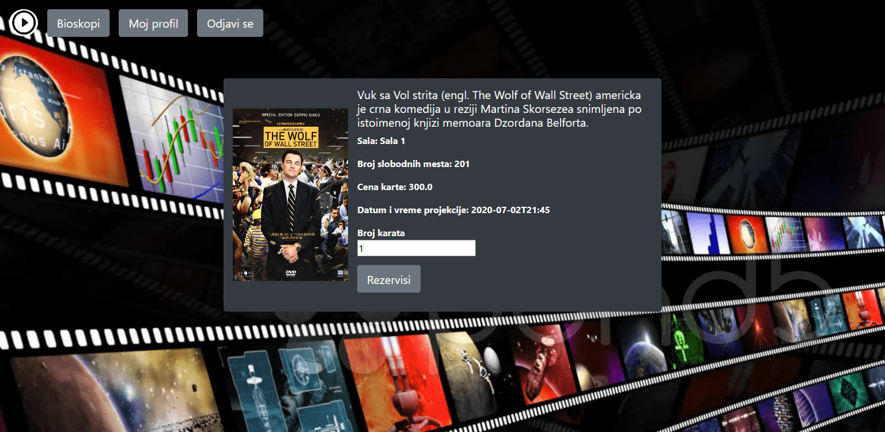
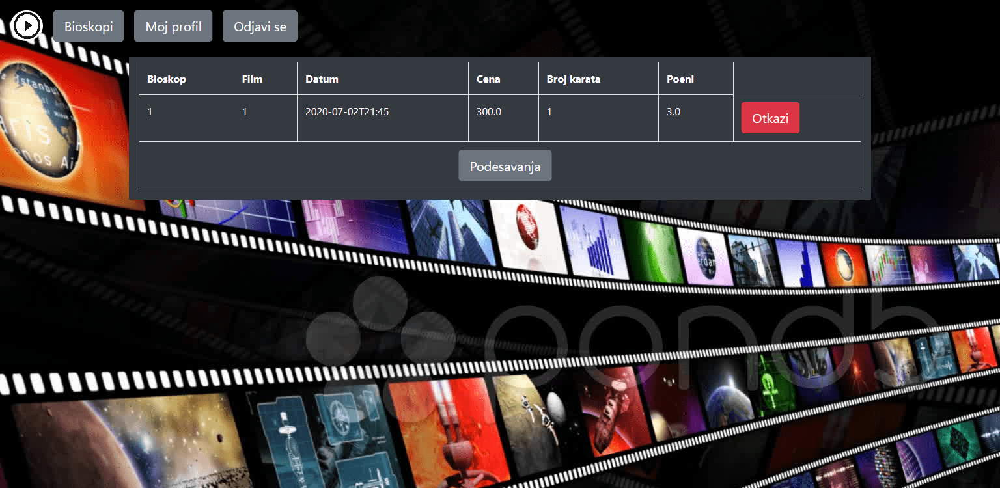
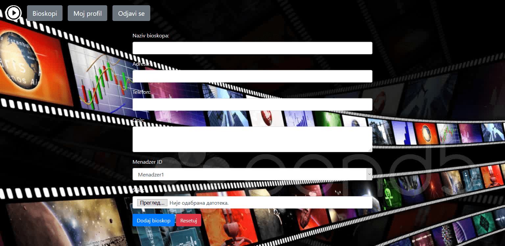
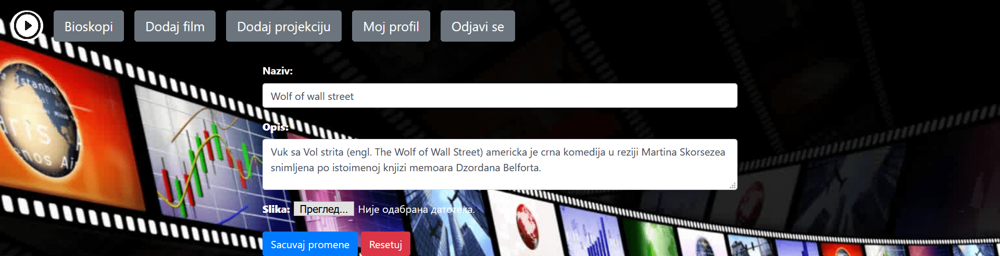

# Web aplikacija za vođenje lanca bioskopa

### Admin

Username: Admin\
Password: Admin

### Manager

Username: Men\
Password: 123456

### User

Username: Samardzija\
Password: 123123

### Pocetna strana

### Registraciona forma

### Login forma

### Lista dostpunih bioskopa u kojim mozemo da gledamo filmove

### Prikaz dostpunih filmova za izabrani bioskop

### Kratak opis izabranog filma i mogucnost rezervacije karte

### Prikaz svih rezervacija za ulogovanog korisnika

### Izmena licnih podataka ulogovanog korisnika

## Admin

### Admin prikaz liste svih bioskopa

### Admin prikaz mogucnosti u profilu

### Admin forma za dodavanje korisnika (Klijent/Admin/Mendazer)

### Admin forma za dodavanje novog bioskopa

### Admin forma za dodavanje nove sale

### Admin menja vec postojeci bioskop

### Admin menja odredjenog korisnika ovog sistema

### Admin manja podatke za izabranu salu

## Menadzeri

### Menadzeru se prikazuje lista bioskopa nad kojima on vrsi promene

### Menadzer otvara listu filmova za odredjeni bioskop

### Menadzer dodaje novi film

### Menadzer dodaje novu projekciju

### Menadzer menja podatke za postojaci film

### Menadzer menja podatke za postojacu projekciju

### Menadzeru se prikazuju sve rezervacije

## License & Copyright

MIT License Copyright © 2020 Marko Samardzija

Permission is hereby granted, free of charge, to any person obtaining a copy
of this software and associated documentation files (the "Software"), to deal
in the Software without restriction, including without limitation the rights
to use, copy, modify, merge, publish, distribute, sublicense, and/or sell
copies of the Software, and to permit persons to whom the Software is
furnished to do so, subject to the following conditions:

The above copyright notice and this permission notice shall be included in all
copies or substantial portions of the Software.

THE SOFTWARE IS PROVIDED "AS IS", WITHOUT WARRANTY OF ANY KIND, EXPRESS OR
IMPLIED, INCLUDING BUT NOT LIMITED TO THE WARRANTIES OF MERCHANTABILITY,
FITNESS FOR A PARTICULAR PURPOSE AND NONINFRINGEMENT. IN NO EVENT SHALL THE
AUTHORS OR COPYRIGHT HOLDERS BE LIABLE FOR ANY CLAIM, DAMAGES OR OTHER
LIABILITY, WHETHER IN AN ACTION OF CONTRACT, TORT OR OTHERWISE, ARISING FROM,
OUT OF OR IN CONNECTION WITH THE SOFTWARE OR THE USE OR OTHER DEALINGS IN THE
SOFTWARE.
